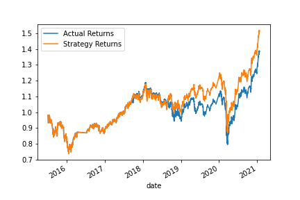
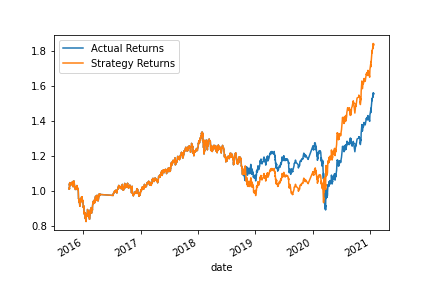
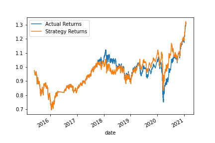

Project Title: Machine Learning Trading Bot

Improved a trading alogrythim 

Technologies The code is written in Py 3.0. 

Installation Guide - 

import pandas as pd
import numpy as np
from pathlib import Path
import hvplot.pandas
import matplotlib.pyplot as plt
from sklearn import svm
from sklearn.preprocessing import StandardScaler
from pandas.tseries.offsets import DateOffset
from sklearn.metrics import classification_report

1.Use the SVC classifier model from SKLearn's support vector machine (SVM) learning method to fit the training data and make predictions based on the testing data. Review the predictions.

2.Review the classification report associated with the SVC model predictions

3.Create a predictions DataFrame that contains columns for “Predicted” values, “Actual Returns”, and “Strategy Returns”.

4. Create a cumulative return plot that shows the actual returns vs. the strategy returns. Save a PNG image of this plot. This will serve as a baseline against which to compare the effects of tuning the trading algorithm.

5.  Create a cumulative return plot that shows the actual returns vs. the strategy returns. Save a PNG image of this plot. This will serve as a baseline against which to compare the effects of tuning the trading algorithm.

Contributors In addtion to me the GW Bootcamp TA, LA, and tutors help me create this project

##FINDINGS 
The base line has 3 month time frame and a short window of 4 and a long window of 100

When I changed the 3 month time frame the stradegy returns improved slightly  

When I change the baseline long window from 50 to 100 the stragegy returns performed closer to the actual returns

License The Source code is for educational purposes only and should not be used to make any professional recomendations. Feel free to use for any educational needs